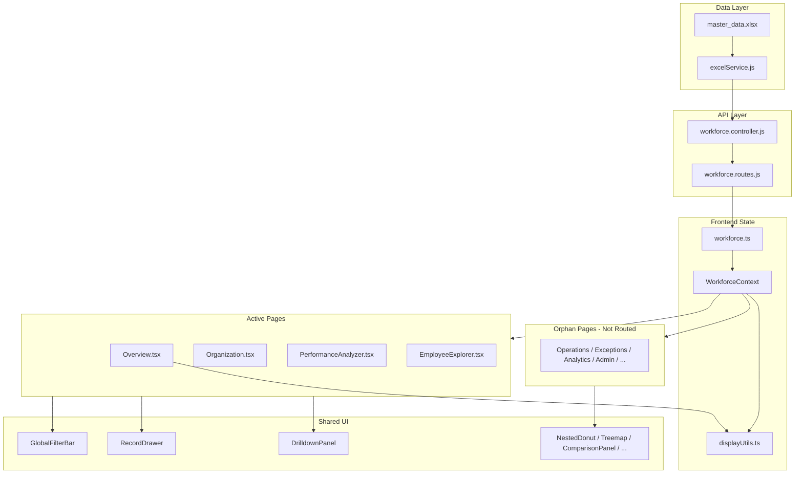

# Akumentis Insight — Recovery & Sales OS Gap Analysis

**Date:** 2026-05-30  
**Scope:** Full-stack audit before Sales Operating System refactor  
**Status:** Analysis only — no code changes applied

---

## Executive Summary

The application is a **React 18 + Vite + TypeScript** frontend and **Node.js/Express** backend. The frontend **builds cleanly** (`tsc -b && vite build` passes). The backend has a mature Excel ingestion layer and **20 workforce API endpoints**, but the **primary data file is missing from the repository**.

During a prior refactor, routing was **consolidated from ~15 pages to 4 active routes**. Most page and component code still exists on disk but is **orphaned** (not imported by `App.tsx`). The active UI partially implements Sales OS concepts (Executive Overview KPIs, donuts, revenue leakage) but still relies on **right-side drawers/panels**, **client-side-only aggregation**, and **incomplete hierarchy** (BU Head → BM only, no Employee leaf).

**Critical blocker:** `backend/data/master_data.xlsx` is not present. Without it, all APIs return empty datasets at runtime.

---

## 1. What Exists Today

### 1.1 Frontend Architecture

| Layer | Location | Notes |
|-------|----------|-------|
| Entry | `frontend/src/main.tsx` | React 18 root |
| Routing | `frontend/src/App.tsx` | React Router v6, protected routes |
| Layout | `frontend/src/components/layout/` | `DashboardLayout`, `Sidebar`, `TopNav` |
| State | `frontend/src/contexts/` | `AuthContext`, `ThemeContext`, `ToastContext`, **`WorkforceContext`** (central data hub) |
| API client | `frontend/src/services/api.ts`, `workforce.ts` | Axios + JWT interceptor |
| Utilities | `frontend/src/utils/displayUtils.ts` | Rich sales math: slabs, health scores, insights, risk cards |
| UI primitives | `frontend/src/components/ui/` | `StatCard`, `Skeleton`, `GlassCard`, `SearchableSelect`, `ExportButton` |
| Workforce widgets | `frontend/src/components/workforce/` | 30+ components (many orphaned) |

**Tech stack:** Tailwind CSS, Framer Motion, Recharts, Lucide icons.

### 1.2 Active Routes (wired in `App.tsx`)

| Route | Page | Purpose |
|-------|------|---------|
| `/login`, `/signup` | `Login.tsx`, `Signup.tsx` | JWT auth |
| `/overview` | `Overview.tsx` | Executive Overview — KPI cards, 3 donuts, revenue leakage, insights |
| `/organization` | `Organization.tsx` | Sales hierarchy explorer (BU Head → BM) |
| `/performance` | `PerformanceAnalyzer.tsx` | RM/BM top/bottom lists, quadrant matrix |
| `/employee-explorer` | `EmployeeExplorer.tsx` | Searchable paginated employee table |

Default redirect: `/` → `/overview`.

### 1.3 Orphaned Pages (exist on disk, NOT routed)

These files compile but are **dead code** from the router’s perspective:

| File | Former role (inferred) |
|------|------------------------|
| `Dashboard.tsx` | Earlier monolithic executive dashboard with inline `DrilldownPanel` |
| `SalesCommandCenter.tsx` | Incomplete command center (hardcoded `--` placeholders) |
| `Hierarchy.tsx` | Alternate hierarchy view |
| `DetailedAnalysis.tsx` | Deep-dive analytics |
| `Performance.tsx` | Earlier performance page (matrix + lists) |
| `Exceptions.tsx` | Exception / risk tabbed view |
| `Operations.tsx` | Coverage, CRM, inventory, compliance metrics |
| `WorkforceOverview.tsx` | HR-style overview (KPI, hierarchy drilldown) |
| `DataExplorer.tsx` | Master data grid explorer |
| `RawData.tsx` | Raw Excel grid |
| `Teams.tsx` | BM/RM team performance |
| `Analytics.tsx` | Vacancy, state, designation, hiring analytics |
| `Admin.tsx` | Data quality + verification |

**Likely cause:** Sidebar and `App.tsx` were rewritten to 4 nav items; pages were not deleted.

### 1.4 Backend Architecture

```
backend/src/
├── server.js          → HTTP server
├── app.js             → Express app, CORS, static dist, route mounts
├── middleware/auth.js → JWT authenticate
├── routes/
│   ├── auth.routes.js
│   └── workforce.routes.js
├── controllers/
│   ├── auth.controller.js
│   └── workforce.controller.js
└── services/
    └── excelService.js  → Single source of truth for Excel parsing
```

**Data path resolution** (`excelService.js`):
1. `backend/data/master_data.xlsx` (primary)
2. `backend/src/data/master_data.xlsx` (fallback)
3. If missing → `{ employees: [], columns: [] }`

### 1.5 Backend API Endpoints

All workforce routes require JWT (`authenticate` middleware).

| Method | Endpoint | Returns |
|--------|----------|---------|
| GET | `/api/workforce/kpi` | Headcount / vacancy KPIs |
| GET | `/api/workforce/sales-kpi` | Revenue, achievement, growth, coverage aggregates |
| GET | `/api/workforce/hierarchy` | Division → Zone → State → HQ → Designation tree |
| GET | `/api/workforce/sales-hierarchy` | BU Head → NSM → ZM → SM → RM → BM tree with revenue |
| GET | `/api/workforce/executive-insights` | Text insights array |
| GET | `/api/workforce/employees` | Filtered employee records |
| GET | `/api/workforce/drilldown/:level/:value` | Employees matching hierarchy filter |
| GET | `/api/workforce/dynamic-filters` | Filter definitions from columns |
| GET | `/api/workforce/treemap` | State/HQ headcount treemap |
| GET | `/api/workforce/data-quality` | Missing values, duplicates |
| GET | `/api/workforce/verify?search=` | Field-level search verification |
| GET | `/api/workforce/bm`, `/rm` | BM/RM grouped by HQ |
| GET | `/api/workforce/states` | Headcount by state |
| GET | `/api/workforce/designations` | Designation distribution |
| GET | `/api/workforce/hiring/:period` | DOJ hiring trend |
| GET | `/api/workforce/vacancy/:dimension` | Vacancy by dimension |
| GET | `/api/workforce/team-trend` | BM/RM hiring trend |
| GET | `/api/workforce/columns` | Column metadata |
| GET | `/api/workforce/column-values?column=` | Distinct values |
| POST | `/api/workforce/reload` | Force Excel cache reload |

**Backward-compat redirects:** `/api/dashboard/*`, `/api/filters/options` → workforce equivalents.

### 1.6 Authentication Flow

- In-memory user store in `auth.controller.js` (admin/manager/viewer demo accounts)
- JWT signed with `JWT_SECRET` from `backend/.env`
- Frontend stores token in `localStorage`; axios interceptor attaches `Authorization: Bearer`
- 401 → redirect to `/login`

Auth is **not** Excel-driven (acceptable). Sales metrics must be Excel-driven.

### 1.7 Data Flow (current)

```
master_data.xlsx
       ↓
excelService.loadExcel()  [cache + mtime invalidation]
       ↓
workforce.controller.js
       ↓
/api/workforce/*
       ↓
workforce.ts (axios)
       ↓
WorkforceContext.fetchAll()  [parallel Promise.allSettled, 300ms debounce]
       ↓
Active pages + displayUtils client-side derivations
```

**Problem:** Heavy aggregation (slabs, risk, rankings, matrix quadrants) runs **in the browser** on the full employee array. Spec requires dynamic backend calculation; current approach works only when Excel is present and loads entirely into memory on the client.

---

## 2. Excel Data Model (inferred — file not in repo)

`master_data.xlsx` was **not found** at:
- `backend/data/master_data.xlsx`
- `backend/src/data/master_data.xlsx`
- `sales-data/master_data.xlsx`

Structure inferred from `excelService.js` and frontend field usage:

### 2.1 Parse Rules

- Row 0: skipped/empty
- **Row 1:** column headers (human-readable names)
- **Row 2+:** employee records
- Headers normalized to snake_case keys via `generateUniqueKey()`
- Known renames: `HQ.` → `hq`, `System HQ` → `hqSystem`, `STATE` → `state`, `Name Of Employee` → `name`, `Emp. Code` → `empCode`, `Dsgn` → `dsgn`

### 2.2 Hierarchy Fields

| Key | Role |
|-----|------|
| `division` | BU / division grouping |
| `zone` | Zone (West, East, North, South — normalized) |
| `state` | State |
| `hq` | HQ / territory |
| `dsgn` | Designation: BU Head, NSM, ZM, SM, RM, BM, ABOLISHED, etc. |
| `name`, `empCode` | Employee identity |

**Note:** Hierarchy is **not** built from explicit manager→report edges in Excel. `getSalesHierarchy()` uses **geographic/designation heuristics** (e.g., ZM matched by zone, BM by HQ). This may not match true reporting lines.

### 2.3 Sales & Performance Metrics

| Key | Metric |
|-----|--------|
| `apr_26_tgt` | Target |
| `net_sale_apr_26` | Net sales / revenue |
| `gross_sale_apr26` | Gross sales |
| `apr26_sec_sales` | Secondary sales |
| `apr_ach` | Achievement (stored as decimal; UI multiplies ×100) |
| `growth` | Growth % |
| `april26_cov` | Coverage % |

### 2.4 Operations / Compliance / CRM Metrics

| Key | Metric |
|-----|--------|
| `april26_avg_working_hrs` | Avg working hours |
| `apr26_inv_days` | Inventory days |
| `april26_dr_coverage` | Doctor coverage |
| `april26_chem_met` | Chemist coverage met |
| `april26_stk_met` | Stock coverage met |
| `april26_comp` | Compliance % |
| `april26_dr_avg` | Doctors per day |
| `april26_crm_dr_visited_count` | CRM doctors visited |
| `april26_crm_dr_missed_count` | CRM doctors missed |

### 2.5 KPI Categories vs Spec

| Spec category | Excel support | Backend API | Frontend usage |
|---------------|---------------|-------------|----------------|
| Revenue / Target | ✅ columns exist | `sales-kpi` partial | Overview, pages |
| Achievement % | ✅ | aggregated in `sales-kpi` | Widespread |
| Growth % | ✅ | aggregated | Widespread |
| Coverage % | ✅ | aggregated | Overview, Operations (orphan) |
| Contribution % | ⚠️ client-only | ❌ no endpoint | `displayUtils.contribution()` |
| Revenue at risk | ⚠️ client-only | ❌ | Overview computes from filters |
| Negative growth count | ⚠️ client-only | ❌ | Overview |
| Low achievement count | ⚠️ client-only | ❌ | Overview |
| Coverage risk count | ⚠️ client-only | ❌ | Overview |
| Team size / direct reports | ⚠️ partial in `sales-hierarchy` | partial | Organization |
| Top/bottom contributors | ⚠️ client-only | ❌ | PerformanceAnalyzer |
| Ownership chain | ❌ | ❌ | Not implemented |
| Employee rank / peer compare | ❌ | ❌ | Not implemented |
| CRM metrics | ✅ columns | ❌ dedicated API | Operations page (orphan) |

---

## 3. What Is Missing vs Sales OS Spec

### 3.1 Critical Gaps

1. **`master_data.xlsx` missing** — runtime empty state on all pages
2. **Routes disconnected** — Revenue Leakage Center, Operations, Comparison, Admin live only as orphan files
3. **Interaction model violation** — `RecordDrawer`, `DrilldownPanel`, Overview `DrillPanel` are **right-side overlays**; spec requires **inline expansion only**
4. **Incomplete hierarchy** — No Employee level under BM; no true manager chain; `getSalesHierarchy` parent-child logic is heuristic
5. **Missing backend aggregations** — Risk scores, ownership chains, rankings, matrix quadrants, comparison engine not served by API
6. **Donut coverage** — Only BM×2 + RM×1 on Overview; spec requires SM, ZM, NSM achievement + growth (10 segments)
7. **Performance matrix** — Only RM/BM tabs; spec requires SM, ZM, NSM matrices
8. **Comparison engine** — `ComparisonPanel.tsx` exists but is **never mounted** in active routes
9. **Global color legend** — Colors used ad hoc; no shared legend component

### 3.2 High-Priority Gaps

1. **Organization Explorer** — Still uses 1/3 right column “click a node” panel + drawers; spec: full-width inline accordion, no side panels
2. **Employee Explorer** — Table-only; no inline intelligence view (health score, manager chain, ranks exist in utils but unused)
3. **Executive Overview** — Missing cards: Best BM, Highest Contributor, Critical Region/State/RM; donut click opens slide-over not inline table
4. **Smart insights** — Backend `getExecutiveInsights` + client `generateInsights()` exist but insights lack structured drill targets (zone/state/RM/BM/employee IDs)
5. **Revenue Leakage Center** — Section on Overview is summary cards only; spec wants dedicated operational section with ownership chain (Zone→State→RM→BM→Employee)

### 3.3 Medium-Priority Gaps

1. **Visualizations** — Treemap, sunburst, heatmaps exist as components but unused in active routes
2. **Skeleton loaders** — `Skeleton.tsx` exists; active pages don’t consistently use loading states from `loadingState`
3. **Employee level in hierarchy API** — Needs explicit leaf nodes for field reps
4. **Filter slabs** — `ach_slab`, `growth_slab` are UI-only filters (`UI_ONLY_FILTERS` in context); not applied server-side

### 3.4 Low-Priority / Cleanup

1. **Orphan `SalesCommandCenter.tsx`** — Contains `--` placeholders and wrong `is_active` field
2. **Duplicate logic** — Slab computation in both `Overview.tsx` and `displayUtils.ts`
3. **Workforce vs Sales naming** — API namespace is `/workforce` but product is Sales OS
4. **Bundle size** — 768KB JS; no code-splitting

---

## 4. What Was Likely Deleted or Overwritten

| Item | Evidence |
|------|----------|
| **Router entries for 11+ pages** | Pages exist; `App.tsx` only imports 4 |
| **Sidebar navigation items** | `Sidebar.tsx` reduced to 4 links; orphan pages had richer nav |
| **`master_data.xlsx`** | Expected path empty; not in git workspace (may be gitignored or never committed) |
| **Dedicated Revenue Leakage route** | Logic partially merged into `Overview.tsx`; `Exceptions.tsx` orphaned |
| **Comparison UI wiring** | `ComparisonPanel` built but not rendered in layout |
| **Sales Command Center route** | `SalesCommandCenter.tsx` stubbed, not routed |

**Not deleted:** Most `components/workforce/*` files — they remain importable for reuse.

---

## 5. Build & Runtime Status

| Check | Result |
|-------|--------|
| TypeScript build | ✅ Pass |
| Vite production build | ✅ Pass |
| Broken imports in active routes | ✅ None |
| Broken imports in orphan pages | ⚠️ Not verified individually; likely OK (same module graph) |
| Git history | ⚠️ Not available in workspace (no `.git`) |
| Backend start without Excel | ✅ Starts; returns empty arrays |
| Runtime with missing Excel | ❌ Empty pages, “No hierarchy data”, zero KPIs |

---

## 6. Dependency Map



### Component reuse matrix (for refactor — do NOT duplicate)

| Spec feature | Reuse candidate |
|--------------|-----------------|
| Executive KPI cards | `Overview.tsx` KPICard, `StatCard.tsx`, `KpiCards.tsx` |
| Donuts (all levels) | Extend `Overview.tsx` DonutCard or `NestedDonut.tsx` |
| Inline drilldown | Refactor `Overview.tsx` DrillPanel → inline; avoid new panel |
| Organization tree | `Organization.tsx` HierarchyCard + `getSalesHierarchy` |
| Performance matrix | `PerformanceAnalyzer.tsx` quadrant + `Performance.tsx` (orphan) |
| Revenue leakage | `displayUtils.computeAttentionRequired()` + `Exceptions.tsx` |
| Operations metrics | `Operations.tsx` (orphan, route it or merge) |
| Comparison | `ComparisonPanel.tsx` + `displayUtils.comparisonMetrics()` |
| Employee intelligence | `displayUtils.healthScore`, `getBadges` + expand `EmployeeExplorer` |
| Insights | `DynamicInsights.tsx`, `getExecutiveInsights`, `generateInsights()` |
| Treemap / heatmap | `TreemapChart.tsx`, `SunburstChart.tsx` |
| Data grid | `MasterDataGrid.tsx` |

---

## 7. Files Needing Restoration or Rewiring

### 7.1 Must restore (data)

| File | Action |
|------|--------|
| `backend/data/master_data.xlsx` | **Restore from backup** — nothing works without it |

### 7.2 Must rewire (routing — no new pages needed)

| File | Action |
|------|--------|
| `frontend/src/App.tsx` | Add routes for Operations/Revenue Leakage, Comparison; or merge into existing 4 pages per spec |
| `frontend/src/components/layout/Sidebar.tsx` | Expand nav to match Sales OS sections |

### 7.3 Refactor in place (active pages)

| File | Action |
|------|--------|
| `frontend/src/pages/Overview.tsx` | Replace slide-over `DrillPanel` with inline expansion; add missing KPI cards; add 7 more donut segments |
| `frontend/src/pages/Organization.tsx` | Remove right column + `RecordDrawer`/`DrilldownPanel`; full-width inline hierarchy to Employee |
| `frontend/src/pages/PerformanceAnalyzer.tsx` | Expand lists beyond top 5; add SM/ZM/NSM tabs; inline drilldown |
| `frontend/src/pages/EmployeeExplorer.tsx` | Add inline employee intelligence panel; remove drawer dependency |

### 7.4 Backend extensions (extend existing service, no parallel parser)

| File | Action |
|------|--------|
| `backend/src/services/excelService.js` | Add: `getAggregatedNodeMetrics`, `getOwnershipChain`, `getPerformanceMatrix`, `getRankings`, `getComparison`, `getSegmentDrilldown` |
| `backend/src/routes/workforce.routes.js` | Expose new endpoints |
| `backend/src/controllers/workforce.controller.js` | Wire controllers |
| `frontend/src/services/workforce.ts` | Add client methods |
| `frontend/src/contexts/WorkforceContext.tsx` | Fetch new endpoints; deprecate drawer state gradually |

### 7.5 Orphan pages — integrate, don’t rewrite

| File | Recommended use |
|------|-----------------|
| `Operations.tsx` | Revenue Leakage Center + coverage/CRM/compliance |
| `Exceptions.tsx` | Risk exception views |
| `ComparisonPanel.tsx` | Mount in layout or Overview |
| `NestedDonut.tsx` | Multi-level donut segments |
| `HierarchicalCommandCenter.tsx` | Organization inline explorer enhancement |

---

## 8. Prioritized Restoration Plan

### 🔴 Critical (blockers — do first)

1. **Restore `backend/data/master_data.xlsx`** from backup or original `sales-data/` source. Verify row layout (headers row 1, data row 2+).
2. **Verify API returns real data** — hit `/api/workforce/employees`, `/sales-kpi`, `/sales-hierarchy` with auth token.
3. **Fix hierarchy to include Employee level** — extend `getSalesHierarchy()` to attach non-manager employees under BM by HQ/state rules (or explicit manager columns if present in Excel).
4. **Remove slide-over dependency on primary flows** — refactor `DrillPanel` / `RecordDrawer` / `DrilldownPanel` on the 4 active pages to inline expansion (spec: no right sidebars).

### 🟠 High (core Sales OS)

5. **Backend aggregation APIs** — revenue at risk, contribution %, negative growth count, coverage risk, top/bottom contributors, ownership chain per employee.
6. **Executive Overview completion** — all specified KPI cards clickable with inline drill; 10 donut segments (BM/RM/SM/ZM/NSM × achievement + growth).
7. **Organization Explorer redesign** — single-column inline accordion BU Head → Employee; every card shows full metric set from API.
8. **Performance Analyzer expansion** — all contributor/leakage lists; matrices for SM/ZM/NSM; inline quadrant people view.
9. **Smart Insight Engine** — structured insights with `{ type, text, filter, entityType, entityId }` for precise drilldown.
10. **Revenue Leakage Center** — wire `Operations.tsx` / `Exceptions.tsx` or dedicated section with ownership chain visualization.

### 🟡 Medium

11. **Employee Explorer intelligence** — inline expand: hierarchy chain, ranks, peer comparison, health score (reuse `displayUtils`).
12. **Comparison Engine** — mount `ComparisonPanel`; backend endpoints for zone vs zone, RM vs RM, etc.
13. **Global color system + legend** — shared tokens in `index.css` or theme; document green/blue/orange/red semantics.
14. **Loading UX** — wire `loadingState` + `Skeleton` across pages.
15. **Re-route orphan pages** or merge content into the 4 primary sections (avoid 15-route sprawl).

### 🟢 Low

16. **Delete or merge stub `SalesCommandCenter.tsx`** after Overview absorbs its intent.
17. **Deduplicate slab logic** — single source in `displayUtils` or backend.
18. **Code-split routes** — reduce bundle size.
19. **Server-side filter slabs** — apply achievement/growth slabs in `getEmployees` filters.

---

## 9. Spec Compliance Snapshot

| Requirement | Current | Target |
|-------------|---------|--------|
| All data from Excel | ⚠️ Designed yes; file missing | Restore file |
| No hardcoded metrics | ⚠️ Client computes from employee array | Move aggregation to backend |
| No mock/static data | ❌ SalesCommandCenter has `--` | Remove stub |
| Dynamic hierarchy | ⚠️ Partial, heuristic | True tree + Employee leaves |
| Inline interactions | ❌ Drawers/slide-overs | Inline expand only |
| 1–2 click business answers | ⚠️ Partial on Overview | All pages |
| Performance matrix all levels | ❌ RM/BM only | SM/ZM/NSM/RM/BM |
| Comparison engine | ❌ Built but unwired | Wire + API |
| Interview-quality UX | ⚠️ Good foundation | Polish + complete |

---

## 10. Recommended Implementation Order (after approval)

```
Phase 0: Restore master_data.xlsx + smoke test APIs
Phase 1: Backend aggregations (hierarchy metrics, risk, rankings, ownership)
Phase 2: Interaction model (inline drilldown shared component — refactor existing DrillPanel)
Phase 3: Overview + Organization (highest visibility)
Phase 4: Performance Analyzer + Employee Explorer
Phase 5: Operations/Revenue Leakage + Comparison + legend
Phase 6: Orphan page integration + cleanup
Phase 7: Full validation checklist from spec
```

---

## 11. Approval Gate

**No application code has been modified in this analysis.**

Before implementation:
1. Confirm `master_data.xlsx` can be placed at `backend/data/master_data.xlsx`
2. Confirm preference: **4 consolidated routes** vs **add Revenue Leakage / Comparison as separate nav items**
3. Approve backend-first aggregation strategy (reduce client-side `displayUtils` duplication over time)
4. Confirm hierarchy rules when Excel lacks explicit manager IDs (HQ/state matching vs column-based reporting)

---

*Generated from full repository audit. Frontend build verified passing. Excel file not present for direct sheet inspection.*
